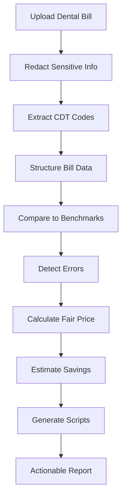

# 🦷 Dental Bill Detective

Smart analysis for dental invoices using real pricing benchmarks and code-level comparisons.

**Live Demo:** https://medical-debt-analyzer.replit.app/  
**Video Demo:** https://drive.google.com/file/d/10oENI09gIJUY11RMzCkIn75edDlDkdP0/view?usp=sharing  

---

## 📋 Overview

AI-powered dental bill review tool that helps patients understand charges, detect overpricing, and generate negotiation-ready outputs.

---

## 🎯 Target

Build a practical tool that helps patients:

- **Understand** confusing dental bills  
- **Detect** overcharges and billing errors  
- **Compare** prices against benchmarks  
- **Generate** negotiation scripts  
- **Take action** instead of blindly paying  

### The Goal

**Turn a dental invoice into leverage.**

---

## 🚀 Core Workflow



---

## 🧠 What This Project Does

The analyzer reads itemized dental bills and performs:

- **CDT code extraction** — Identifies procedure codes from unstructured text
- **Price comparison** — Benchmarks against fair pricing datasets
- **Error detection** — Flags duplicates, unbundling, and inflated pricing
- **Savings estimation** — Calculates potential cost reductions
- **Negotiation script generation** — Creates ready-to-use talking points
- **Appeal letter generation** — Produces formal dispute documentation

**Result:** Converts messy bill text into a structured report patients can act on.

---

## 🛠 Tech Stack

| Component | Technology |
|-----------|------------|
| **Platform** | Replit |
| **Backend** | Node.js |
| **Frontend** | BEM structure |
| **AI Parsing** | Custom dental code extraction |
| **Data** | Proprietary pricing benchmarks |
| **OCR** | Bill image processing |
| **Privacy** | Local processing |

---

## 🔍 Key Features

### Smart Code Extraction
Reads unstructured bills and identifies CDT procedure codes automatically.

### Fair Price Analysis
Compares billed amounts to benchmark pricing from multiple data sources.

### Error Detection
Flags common billing issues:
- Duplicate charges
- Unbundled procedures
- Suspicious markups

### Savings Estimate
Provides clear breakdown:
- Total billed amount
- Fair value estimate
- Potential savings
- Markup percentage

### Negotiation Toolkit
Auto-generates actionable materials:
- Phone call scripts
- Formal appeal letters
- Evidence-based talking points

---

## 🔒 Privacy & Security

- ✅ **No bill data stored**
- ✅ **PII redaction**
- ✅ **Local processing** where possible
- ✅ **HIPAA-conscious design**

---

## 📊 Example Output

```
Your bill is 52% above fair pricing.
Potential savings: $1,240

Issues found:
• Duplicate X-ray charge ($180)
• Cleaning priced 2.3× benchmark ($320 overcharge)
• Unbundled exam code ($160 overcharge)

Next step:
Call billing department and request adjusted rate using provided script.
```

---

## 🧪 Current Status

**Active development** focused on:

- ✨ Improving CDT extraction accuracy
- 📊 Expanding pricing datasets
- 🧾 Testing with real patient bills
- 💬 Refining negotiation output quality
- 🎨 UI/UX improvements

---

## 🧭 Why This Exists

**The Problem:**
- Dental pricing is opaque
- Patients rarely know if prices are fair
- Most people overpay without realizing it

**The Solution:**
This tool provides **clarity → leverage → savings**

---

## 📌 Next Steps

- [ ] Expand benchmark datasets with regional pricing
- [ ] Improve OCR accuracy for handwritten bills
- [ ] Add insurance-aware analysis
- [ ] Public deployment infrastructure
- [ ] PDF/CSV report export functionality

---

## ⚠️ Disclaimer

This tool provides **guidance only** and is not legal, financial, or medical advice. Always consult with qualified professionals for specific situations.

---

## 💡 Vision

**Upload any healthcare bill and instantly know:**

> *Is this fair? What should I do?*

Transform medical billing from confusion into clarity, one invoice at a time.

---

## 🤝 Contributing

Interested in improving healthcare billing transparency? Contributions welcome.

---

## 📄 License

*To be determined*

---

**Built with the belief that patients deserve to understand what they're paying for.**
