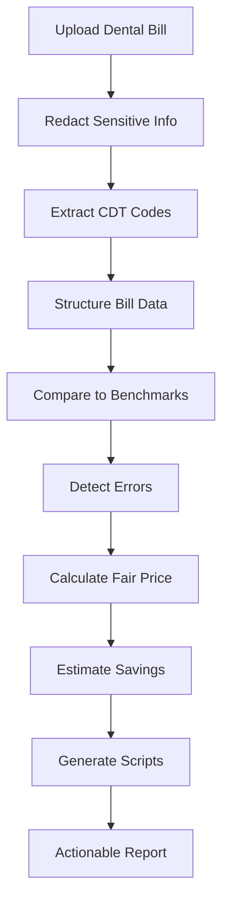

# 🦷 Dental Bill Detective

Smart analysis for dental invoices using real pricing benchmarks and code-level comparisons.

**Live Demo:** https://medical-debt-analyzer.replit.app/  
**Video Demo:** https://drive.google.com/file/d/10oENI09gIJUY11RMzCkIn75edDlDkdP0/view?usp=sharing  

AI-powered dental bill review tool that helps patients understand charges, detect overpricing, and generate negotiation-ready outputs.

---

## 🎯 Target

Build a practical tool that helps patients:

- Understand confusing dental bills  
- Detect overcharges and billing errors  
- Compare prices against benchmarks  
- Generate negotiation scripts  
- Take action instead of blindly paying  

The goal is simple:  
**turn a dental invoice into leverage.**

---

## 🚀 Core Workflow

🧠 What This Project Does
The analyzer reads itemized dental bills and performs:

CDT code extraction

Price comparison vs benchmark datasets

Error detection (duplicates, unbundling, inflated pricing)

Savings estimation

Negotiation script generation

Appeal letter generation

It converts messy bill text into a structured report patients can act on.

🛠 Tech Stack
Replit

Node.js

BEM frontend structure

AI parsing for dental code extraction

Custom pricing datasets

OCR for bill images

Local processing for privacy

🔍 Key Features
Smart Code Extraction
Reads unstructured bills and identifies CDT procedure codes.

Fair Price Analysis
Compares billed amounts to benchmark pricing.

Error Detection
Flags:

Duplicate charges

Unbundled procedures

Suspicious markups

Savings Estimate
Shows:

Total billed

Fair value

Potential savings

% markup

Negotiation Toolkit
Auto-generates:

Phone scripts

Appeal letters

Talking points

🔒 Privacy
No bill data stored

PII redaction

Local processing where possible

📊 Example Output
Your bill is 52% above fair pricing.
Potential savings: $1,240

Issues found:
- Duplicate X-ray charge
- Cleaning priced 2.3× benchmark
- Unbundled exam code

Next step:
Call billing and request adjusted rate using script.
🧪 Current Status
Active build focused on:

Improving CDT extraction

Expanding datasets

Testing real bills

Refining negotiation output

UI improvements

🧭 Why This Exists
Dental pricing is opaque.
Patients rarely know if prices are fair.
Most overpay.

This tool gives:

clarity → leverage → savings

📌 Next Steps
Expand benchmark datasets

Improve OCR accuracy

Insurance-aware analysis

Public deployment

Report export

⚠️ Note
This tool provides guidance only and is not legal or financial advice.

💡 Vision
Upload any healthcare bill
and instantly know:

Is this fair? What should I do?

---

### Why this version works
- Mermaid block properly closed  
- No HTML ` ` inside nodes  
- Clean header structure  
- GitHub-safe formatting  
- Reads like a real startup repo  

---

### If Mermaid still errors
Tell me:
- GitHub repo link  
- Error message screenshot  

I’ll fix it to **render 100% correctly**.
